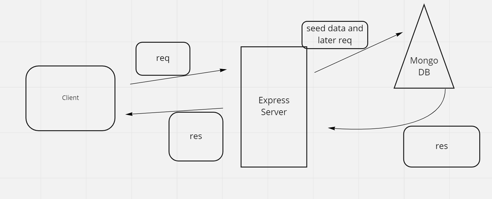

# can-of-books-back-end

**Authors**: Ryan McMillan, Dwight Lindquist, and Michael Maker!
**Version**: 3.0.0

## Overview

Our collective human organization lin-mc-mak shall create a small app to track what books have impacted us, and what’s recommended to read next

<!-- Provide a high level overview of what this application is and why you are building it, beyond the fact that it's an assignment for this class. (i.e. What's your problem domain?) -->

## Getting Started

1. `npm i` on terminal within project repo

2. Encode .env file based on sample.env

<!-- What are the steps that a user must take in order to build this app on their own machine and get it running? -->

## Architecture

<!-- Provide a detailed description of the application design. What technologies (languages, libraries, etc) you're using, and any other relevant design information. -->

## Change Log

03-28-2022 18:33 - Application now has a fully-functional express server, with a GET route for the database request.
Seed function can be used to instantiate data into database.

03-30-2022 11:40 - Front end now has simple login form and header navigation between home page and profile page. Back-end now has connection with mongoDB and can GET seed data from database, will be adding CREATE and DELETE functionality.

04-02-2022 14:15 - Add functionality to front and back end of application to allow user to add books to the database and delete from database.

## Estimates

Name of feature: Book Storage

Estimate of time needed to complete: 3:30

Worked over multiple days

Actual time needed to complete: about 8 hours

---

Name of feature: Book Add and Delete from DB

Estimate of time needed to complete: 4:00

Worked over multiple days

Actual time needed to complete: about 9 hours

---

How Our Web Request Response Cycle Functions

## Credit and Collaborations

Referenced [CodeFellows GitHub resources](https://github.com/codefellows)

### Logistical

What hours will you be available to communicate?

* Class hours working during lab time
  
* Communicate during lab time, after hour or early comms will be discussed when the need arises.

What platform will you use to communicate (ie. Slack, phone …)?

* Slack

How often will you take breaks?

* 5-10 minute break per hour

What is your plan if you start to fall behind?

* We will do morning work and follow stricter TA 15-minute rule

### Cooperative

Make a list of each person’s strengths.

* Michael: Good at communications

* Ryan: Git skill

* Dwight: Skilled web searcher

How can you best utilize these strengths in the development of your application?

* We will utilize strengths by dividing up work according to our strengths

In what areas do you each want to develop greater strength?

* Michael: Data parsing

* Ryan: Work-flow

* Dwight: Git skill

Knowing that every person in your team needs to understand the code, how do you plan to approach the day-to-day development?

* If we have questions for each other we will answer thoroughly and encourage equal input.

### Conflict Resolution

What will your team do if one person is pulling all the weight while the other person is not contributing?

* Talk about it and re-distribute the work so we all learn with happiness emotion in 'human mind'

What will your team do if one person is taking over the project and not letting the other member contribute?

* Talk about it and re-distribute the work so we all learn with happiness emotion in 'human mind'

How will you approach each other and the challenge of building an application knowing that it is impossible for two people to be at the exact same place in understanding and skill level?

* Help and encourage each other if there's a lack of understanding so all members understand.

---
---
